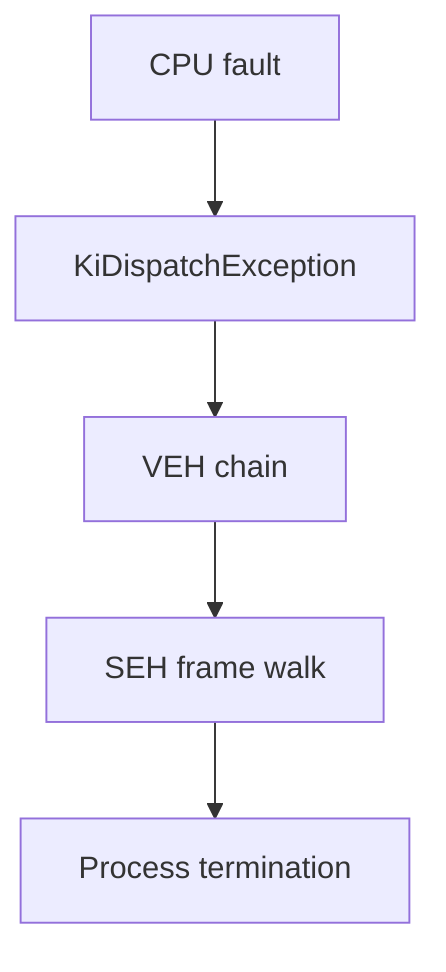

# No Exceptions

## Vectored Exception Handling

Security practitioners · ~30 min

---
layout: default
---

# Windows exception dispatch

VEH runs **before** SEH. First handler that does not return `EXCEPTION_CONTINUE_SEARCH` wins.

---
layout: default
---

# KTRAPs (high level)

- User-mode fault → kernel trap (`#DE`, `#PF`, …) → `KiDispatchException`
- Kernel builds `EXCEPTION_RECORD` + x64 `CONTEXT`, copies to user stack
- User-mode dispatcher walks **VEH** then **SEH** (`RtlDispatchException` / `RtlUnwindEx`)
- Handlers receive `EXCEPTION_POINTERS { ExceptionRecord, ContextRecord }`

Practitioners care about **what lands in CONTEXT**, not the full kernel stack walk.

---
layout: default
---

# CONTEXT (x64) — fields we touch

| Field | Role in handlers |
|-------|------------------|
| `Rip` | Resume address — advance to skip faulting insn, or redirect to `syscall` |
| `Rax` | Return value / syscall number (`SSN`) |
| `R10` | Syscall arg0 (`RCX` is clobbered by `syscall`) |
| `Rcx` | 1st arg in Win64 calling convention; source for `R10` at syscall |

Offensive sections reuse these fields to tamper with execution at exception time.
