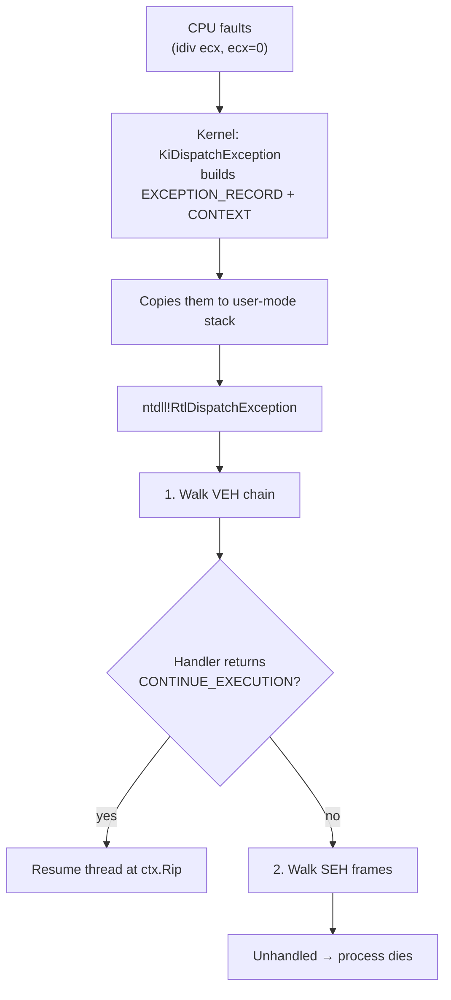

# No Exceptions

## Vectored Exception Handling on Windows

<!--
Welcome. This talk is about a single Windows primitive — Vectored Exception Handling — that sits at the intersection of defense and offense.

By the end you should be able to (1) explain to a colleague what a VEH is, (2) recognize when an EDR is using one, and (3) understand the two common offensive patterns that abuse it.

Tone: practitioner, not academic. We'll do code, demos, and concrete CPU behavior — no hand-waving.
-->

---
layout: default
---

# Agenda

1. **What is VEH?**
2. **How does it work?**
3. **Who uses it?**
4. **Two offensive patterns**

<!--
Roadmap. Read these out loud.

Stress points 3 and 4 — those are the "so what" of the talk. Items 1 and 2 are foundation; we have to do them, but they're not the payoff.

If anyone asks "why Zig?" — because the demos are small, statically compiled, and the win32 type definitions are explicit and readable. Could be C, could be Rust. Pick your favourite.
-->

---
layout: default
---

# First: what *is* an exception?

A **CPU-level event** the operating system has to react to.

| Cause                | Example                   |
| -------------------- | ------------------------- |
| Divide by zero       | `idiv ecx` with `ecx=0`   |
| Bad memory access    | dereferencing `NULL`      |
| Hit a `int3`         | debugger breakpoint       |
| Single-step flag set | hardware breakpoint fired |

The CPU stops the current instruction, the kernel takes over, and a **user-mode dispatcher** asks: *"does anyone want to handle this?"*

<!--
This is the part students most often skip and then get lost.

"Exception" in Windows terminology = a synchronous CPU event, not a C++ throw and not a Python try/except. It's hardware-driven.

Walk the table. Emphasize: every row is something that happens deep inside the CPU. The OS doesn't pick exceptions to deliver — the CPU forces them.

The phrase "does anyone want to handle this?" is the punchline for the rest of the talk. VEH is one of the ways you say "yes, I do."
-->

---
layout: default
---

# Why should you care?

### Defender
- EDRs register VEH to **observe every fault** in a target process
- Cheap, no kernel driver needed
- Great signal: single-steps, illegal instructions = may be malicious

### Attacker
- Knowing the EDR's handler runs first lets you **hide tradecraft inside an exception**
- Or: register your own handler, do a normal-looking thing, get the CPU to land somewhere unusual
- VEH is also the mechanism behind several **syscall evasion** techniques

<!--
This is the motivation slide. Take your time here.

Defender side: many commercial EDRs inject a DLL into every process, that DLL registers a VEH, and uses it as a poor-man's-tracer. It catches things hookers and unwinders miss, like RWX execution at an unexpected RIP.

Attacker side: if you know there's an EDR VEH listening, two things follow. (1) You may be able to neutralize it (out of scope here, but mentioned in references). (2) You can craft exceptions where the kernel's view of `Rip`, `Rax`, `R10` lies about what the program is actually doing. We'll see both.

The v-click reveal is the framing for the whole talk: same mechanism, defense and offense, depending on who registered first.
-->

---
layout: default
---

# How an exception reaches your code

**VEH runs before SEH.** First handler that returns `EXCEPTION_CONTINUE_EXECUTION` wins — the thread resumes at whatever `Rip` your handler left in `CONTEXT`.

<!--
This is the single most important diagram in the talk. Walk it left-to-right, top-to-bottom, slowly.

Key beats:
1. The CPU does NOT know about VEH. It just traps to the kernel.
2. The kernel builds two structs — EXCEPTION_RECORD (what happened) and CONTEXT (register state at the moment of fault) — and hands control to user mode.
3. ntdll's dispatcher walks two lists: VEH first, then SEH. People who learned Windows in the SEH era often think of SEH as primary; for modern attack/defense it's the other way around.
4. The "winner" is whoever returns CONTINUE_EXECUTION. If everyone defers (CONTINUE_SEARCH), SEH gets a shot. If nobody handles, the process is terminated by the default unhandled exception filter.
-->

---
layout: default
---

# `CONTEXT` — the four fields you'll touch

| Field | What it is                          | Why we care                                                         |
| ----- | ----------------------------------- | ------------------------------------------------------------------- |
| `Rip` | Resume address                      | Advance to **skip** a faulting insn, or **redirect** execution      |
| `Rax` | Return value / syscall number       | The kernel reads this to pick which syscall to dispatch             |
| `R10` | Syscall arg 0                       | `syscall` clobbers `Rcx`, so Win64 puts arg 0 in `R10` for syscalls |
| `Rcx` | 1st arg in Win64 calling convention | Source of `R10` when transitioning to kernel                        |

> The handler receives a **pointer** to `CONTEXT`. Writes go back to the thread on resume.

<!--
The full CONTEXT struct is ~1.2 KB of register state — XMM, FP, segment selectors, debug regs, the works. For this talk, only these four matter.

Rip is the star: every demo today either bumps it (`+= 2` to skip a 2-byte idiv) or rewrites it (jump to a `syscall` stub elsewhere in ntdll).

Rax/R10/Rcx matter only for syscall-related demos. The Win64 calling convention puts arg 0 in Rcx, but the SYSCALL instruction itself uses Rcx as its return-to-userland address — so the kernel ABI puts arg 0 in R10 instead. If you ever wondered why Nt* stubs start with "mov r10, rcx" — that's why.

Lay this groundwork now; you'll thank yourself in section 5.
-->
