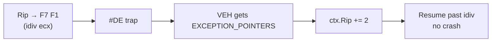

# VEH in one sentence

> A **callback** the OS invokes for *every* exception in your process, **before** any C++ `try/catch` or Win32 `__try/__except` gets a chance.

Three things you do:

1. **Register** a function: `AddVectoredExceptionHandler`
2. **Inspect** the exception in your callback (read `EXCEPTION_RECORD` + `CONTEXT`)
3. **Decide** what happens next via the **return code**

That's the whole API. The rest is what you do *inside* the callback.

<!--
This is the elevator pitch. If a student walks out remembering only this slide, they've got the core.

Compare to SEH: SEH frames are per-function, set up by the compiler. They form a stack along your call chain. VEH is a process-wide list of callbacks — it doesn't care which function faulted.

Compare to a signal handler on Linux: closer, but signals are async-safe-only. VEH callbacks run on the offending thread, synchronously, with a normal stack. You can do anything.

The "before SEH" point matters for defense: if an app has try/catch around its own division, the VEH still sees it first. EDRs love that.
-->

---
layout: default
---

# Registering a handler

```c
PVOID AddVectoredExceptionHandler(
    ULONG                       First,    // 1 = head, 0 = tail
    PVECTORED_EXCEPTION_HANDLER Handler   // your callback
);
```

- `First = 1` → insert at the **head** of the chain (runs first on dispatch)
- `First = 0` → insert at the **tail**
- Chain is walked **before** any SEH frame handler
- Return value is an opaque handle for `RemoveVectoredExceptionHandler`

<!--
Tiny API surface. Three behaviours to internalize:

1. The `First` flag is not a priority — it's an insertion position. If two handlers both pass First=1, the *later* one ends up at the very head.

2. The chain is process-wide, not thread-local. Any handler can see any thread's exception.

3. The handle is just for removal. You can't introspect it via API (which is what makes the offensive section interesting — we have to RE the internal data structure to manipulate the chain directly).

EDRs almost always pass First=1 because they want to see exceptions before the application's own logic. Attackers who want to win the race have to either prepend with First=1 *later*, or splice the chain manually.
-->

---
layout: default
---

# What your handler receives

```c
LONG VectoredHandler(EXCEPTION_POINTERS *info);

typedef struct _EXCEPTION_POINTERS {
    EXCEPTION_RECORD *ExceptionRecord;  // what happened
    CONTEXT          *ContextRecord;    // CPU state, mutable
} EXCEPTION_POINTERS;
```

| Read from `ExceptionRecord`                       | Read/write on `ContextRecord` |
| ------------------------------------------------- | ----------------------------- |
| `ExceptionCode` (e.g. `0xC0000094` = div-by-zero) | `Rip` (resume here)           |
| `ExceptionAddress` (faulting instruction)         | `Rax`, `R10`, `Rcx`, …        |
| `ExceptionInformation[]` (extra context)          | `Dr0–Dr7` (debug regs)        |

> **The CONTEXT pointer is mutable.** Write to it and the kernel resumes the thread with your edits.

<!--
This slide is doing a lot. Take the time to land it.

The pun of the whole API: `ContextRecord` is not a snapshot, it's a live register file. The kernel re-loads from it on resume. So a handler can:
- read Rip to know where the fault was,
- subtract or add bytes to step over an instruction,
- rewrite Rax/R10/etc. to change what a syscall does,
- clear Dr0 to disarm a hardware breakpoint, etc.

That mutability is THE feature that makes VEH useful for offensive work. Without it, you'd be a passive observer.

ExceptionRecord is read-only in practice. The ExceptionInformation array is exception-specific (for #PF it tells you the faulting address and access type; for breakpoints it's empty).
-->

---
layout: default
---

# Handler return codes

| Return                         | Value | Effect                                    | Mental model                    |
| ------------------------------ | ----- | ----------------------------------------- | ------------------------------- |
| `EXCEPTION_CONTINUE_SEARCH`    | `0`   | Pass to next VEH / SEH                    | "Not mine, try the next one"    |
| `EXCEPTION_CONTINUE_EXECUTION` | `-1`  | Resume at (possibly edited) `CONTEXT.Rip` | "I fixed it, resume the thread" |
| `EXCEPTION_EXECUTE_HANDLER`    | `1`   | Run associated SEH handler                | Rare in VEH                     |

<!--
The two patterns at the bottom are the only two return codes anyone really uses in VEH.

CONTINUE_SEARCH is the "I'm just watching" return — it's what every EDR spy handler returns. Importantly: it does NOT mean "the exception is unhandled." It means "I personally do not claim it; ask the next handler."

CONTINUE_EXECUTION is the active one. The thread literally goes back to whatever Rip you left in the context. If you forget to bump Rip past the faulting instruction, you'll get an infinite loop of exceptions — a common student bug.

EXECUTE_HANDLER is mostly historical. In VEH it doesn't really make sense; in SEH it tells the OS to invoke the `__except` block. Don't return this from a VEH unless you know exactly why.
-->

---
layout: two-cols
layoutClass: gap-8
zoom: 0.9
---

# Example: `idiv` by zero

`EXCEPTION_INT_DIVIDE_BY_ZERO` = `0xC0000094`.

Picked because it is:
- **predictable** (every CPU raises it)
- **harmless** (no memory corruption)
- **exactly 2 bytes long** (`F7 F1` = `idiv ecx`)

→ Handler adds `2` to `Rip` and resumes past it.



```asm
mov eax, 1
xor edx, edx
mov ecx, 0
idiv ecx        ; 2 bytes, raises #DE -> 0xC0000094
```

<!--
Why divide-by-zero and not, say, access violation? Two reasons:

1. AVs touch memory and can have side effects (page faults that succeed, etc.). Div-by-zero is the cleanest possible CPU fault — pure register operation, deterministic exception code.

2. The instruction is exactly 2 bytes long. To resume past it we just add 2 to Rip. With variable-length x86 encoding, that "skip the faulting insn" trick is normally a disassembly problem. Idiv ecx is the smallest possible escape hatch.

Important pedagogical point: in the offensive section we won't "skip" instructions — we'll *redirect* execution. Same primitive (write Rip, return CONTINUE_EXECUTION), different intent.

If anyone asks how we know it's exactly F7 F1: that's the ModR/M-encoded idiv with the ecx register. Show them objdump or godbolt if there's time.
-->
