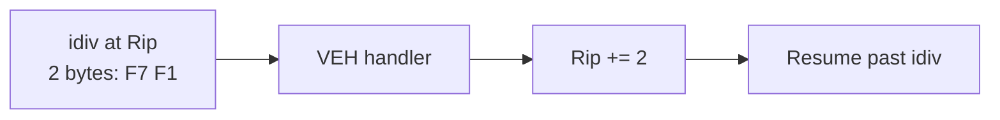

# Vectored Exception Handlers

```c
PVOID AddVectoredExceptionHandler(ULONG First, PVECTORED_EXCEPTION_HANDLER Handler);
```

- `First = 1` → insert at **head** of chain (runs first on dispatch)
- `First = 0` → insert at **tail**
- Chain is walked **before** any SEH frame handler
- Return value is an opaque handle for `RemoveVectoredExceptionHandler`

---
layout: default
---

# Handler return codes

| Return | Value | Effect |
|--------|-------|--------|
| `EXCEPTION_CONTINUE_SEARCH` | `0` | Pass to next VEH / SEH |
| `EXCEPTION_CONTINUE_EXECUTION` | `-1` | Resume at updated `CONTEXT.Rip` |
| `EXCEPTION_EXECUTE_HANDLER` | `1` | Run associated SEH handler (rare in VEH) |

Most teaching demos: log → patch `Rip` → `EXCEPTION_CONTINUE_EXECUTION`.

---
layout: two-cols
layoutClass: gap-8
zoom: 0.9
---

# Divide-by-zero teaching fault

`EXCEPTION_INT_DIVIDE_BY_ZERO` (`0xC0000094`) — predictable, no memory corruption.

::right::



On x64, `idiv ecx` encodes as **2 bytes**. Handler advances `Rip` by 2 to skip the faulting instruction.

```asm
mov eax, 1
xor edx, edx
mov ecx, 0
idiv ecx        ; triggers #DE → NTSTATUS 0xC0000094
```
