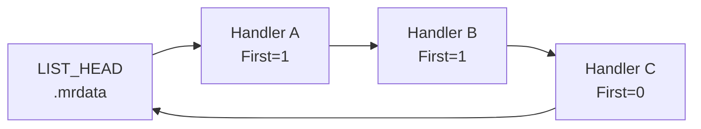

# Minimal Zig VEH

<<< @/../snippets/01-basic-veh/src/main.zig {20-41}

`AddVectoredExceptionHandler(1, …)` → trigger div-by-zero → `Rip += 2` → continue.

---
layout: default
---

# Live demo — `01-basic-veh`

```powershell
cd snippets/01-basic-veh
zig build run
```

Expected: handler prints exception code, Rip adjustment, `[ok] continued execution`.

<!-- capture output before talk -->

---
layout: default
---

# VEH chain order



Registration order with `First=1` prepends — **last registered runs first**.

Optional reference — `02-veh-chain`:

<<< @/../snippets/02-veh-chain/src/main.zig {20-38}
