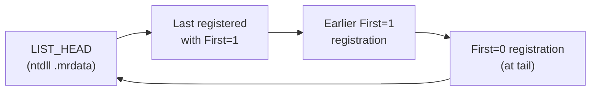

# Minimal Zig VEH — the whole thing

<<< @/../snippets/01-basic-veh/src/main.zig {20-41}

<!--
Walk this code line by line. It's tiny, but every line earns its place.

Lines 20-31 (handler):
- Signature matches the typedef from the previous section.
- We check ExceptionCode and bail out (CONTINUE_SEARCH) if it's not div-by-zero. ALWAYS filter by code — your handler runs for every exception in the process, including ones from threads you didn't even create.
- Then we read ctx.Rip, bump it by 2 (the idiv length), log, and return CONTINUE_EXECUTION.

Lines 33-41 (trigger):
- We use inline assembly because Zig's @divTrunc with a runtime-zero divisor would also work, but inline asm guarantees the exact instruction. No optimizer surprises.
- The four-instruction sequence sets up the registers and divides — exactly what we tell the audience to expect.

Why inline asm and not a volatile pointer trick? Both work. Inline asm makes the bytes visible. Pedagogically, it pairs cleanly with "the handler will skip 2 bytes."
-->

---
layout: default
---

# Live demo — `01-basic-veh`

```powershell
cd snippets/01-basic-veh
zig build run
```

Expected:

```
01-basic-veh
============
[*] triggering divide-by-zero...
[VEH] caught 0xc0000094
[VEH] Rip 0x7ff7... -> 0x7ff7... (+2)
[ok] continued execution
```

<!--
RUN THE DEMO LIVE. The whole point of this section is that this works.

Point out three things in the output:
1. "[*] triggering..." — main() is about to fault.
2. "[VEH] caught 0xC0000094" — the kernel delivered the exception; our handler ran. That code IS divide-by-zero (NTSTATUS form).
3. "[VEH] Rip 0x... -> 0x... (+2)" — we mutated the resume address.
4. "[ok] continued execution" — main() resumed. We never crashed.

If for any reason the demo fails (Zig version mismatch, antivirus), fall back to the captured output here. Same teaching value.
-->

---
layout: default
---

# What if there are multiple handlers?



It's a **circular doubly-linked list** of callbacks.

- `First=1` registrations **prepend** at the head — last call wins the "I run first" race
- `First=0` registrations append at the tail — they run last
- Walk **stops** the moment a handler returns `EXCEPTION_CONTINUE_EXECUTION`

<!--
Two beats here:

1. The list is real and lives in ntdll's .mrdata segment. We'll come back to that in the EDR section — that's where attackers go to manipulate the chain without using the API.

2. "Last registered with First=1 wins" is the most common gotcha. If an EDR DLL registers at process startup with First=1, and your code later also registers with First=1, YOUR handler runs first. That alone is one of the simpler ways to defeat naive VEH monitoring.

But it doesn't always work, because (a) the EDR can re-register on a timer, (b) the EDR can patch the chain head, and (c) some EDRs walk the chain on every dispatch and re-order it. Hence why the offensive techniques get exotic.
-->

---
layout: default
zoom: 0.9
---

# VEH chain — `02-veh-chain`

<<< @/../snippets/02-veh-chain/src/main.zig {20-39}

Registration order: **B (First=1) → A (First=1) → C (First=0)**.
Dispatch order: **A → B → (stop)**. C never runs because B returns `CONTINUE_EXECUTION`.

<!--
Walk through the three handlers:
- A: logs, returns SEARCH (passive).
- B: logs, bumps Rip, returns EXECUTION (active).
- C: logs, returns SEARCH (passive, registered with First=0 so it sits at the tail).

Then walk through the registration order in main():
- Register B first with First=1 — chain is [B].
- Register A with First=1 — A prepended — chain is [A, B].
- Register C with First=0 — appended — chain is [A, B, C].

Dispatch: A runs, returns SEARCH → B runs, returns EXECUTION → walk stops. C never fires.

Predict the output before running: `[handler-A] -> SEARCH`, `[handler-B] -> EXECUTION`, then `[ok]`. Run live to confirm. The fact that C is silent is the punchline.
-->

---
layout: default
---

# Live demo — `02-veh-chain`

```powershell
cd snippets/02-veh-chain
zig build run
```

Expected:

```
[*] triggering divide-by-zero...
[handler-A] code=0xc0000094 -> SEARCH
[handler-B] code=0xc0000094 -> EXECUTION
[ok] continued execution
```

C is **silent** — the moment B returned `CONTINUE_EXECUTION`, the walk stopped.

<!--
Run live if time allows. If skipping the demo, just narrate from this slide.

The silence of handler C is the entire point. Some students will expect a "tail handler" or "default handler" to always run. It doesn't. The walk literally stops.

Tie back: this is exactly why EDR vendors fight to be first in the chain and why bypass tooling fights to insert above them or to short-circuit the walk.
-->
