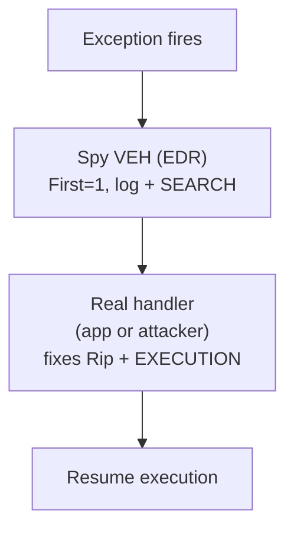

# How does an EDR see inside your process?

Three common in-process telemetry primitives:

| Mechanism                                  | What it sees                                             | Cost            | Visibility                           |
| ------------------------------------------ | -------------------------------------------------------- | --------------- | ------------------------------------ |
| **Kernel callbacks** (PsSet…, ObRegister…) | Process/thread/handle events                             | Driver required | Hard to evade from user-mode         |
| **Inline hooks** on ntdll exports          | Every `Nt*` API call                                     | Cheap, fragile  | Trivially detectable, easily patched |
| **Vectored exception handler**             | Every CPU fault (Access Violation, Breakpoint, #DE, #DB) | Free, robust    | The topic of this section            |

VEH is the **"watch everything weird"** channel. Not a replacement for the others — a complement.

<!--
Frame why this section exists. EDR vendors don't pick one; they layer all three.

Kernel callbacks: most authoritative, but require a signed driver. Out of reach for many telemetry agents; also targeted by anti-EDR tooling.

Inline hooks (NtAllocateVirtualMemory etc.): every other talk on EDR you'll ever see covers these. They're a known game; offensive tooling routinely unhooks ntdll on startup.

VEH: subtler. The EDR registers a handler, every exception in the process gets observed. Even if you unhook ntdll, you can't hide an actual #PF or #DE — the CPU forces the exception, the kernel delivers it, the EDR sees it.

For attackers: this is why "I unhooked ntdll" isn't sufficient if the agent is also using VEH. You either silence the VEH or you avoid making the kinds of faults it watches for.
-->

---
layout: default
---

# Why VEH is attractive for EDRs

- **No driver**: registered from the injected user-mode DLL on `DllMain`
- **No patching**: zero modifications to other modules — quiet on tamper checks
- **No callbacks to install**: one API call, done
- **Catches what hooks miss**: stomp-loaded shellcode that raises Access Violation at an unexpected `Rip`, single-step from a debugger, illegal opcodes, syscall stub redirection (next section)

Typical use: register `First=1`, **log** the event (code + address + thread + module the `Rip` falls in), return `EXCEPTION_CONTINUE_SEARCH`.

<!--
Put yourself in the EDR developer's shoes. You inject a DLL into every process. You want signal on suspicious behaviour. You want to be cheap and quiet.

VEH gives you a single chokepoint for EVERY exception. Process running normally? You see nothing — exceptions are rare. Process suddenly throws an AV on RWX memory at a Rip outside any loaded module? You log a beacon stage and probably kill the process.

The return value matters enormously: returning CONTINUE_SEARCH means the app's own try/catch still works. The EDR is transparent until it decides to act. That's the design.

Mention: this is also why some legitimate apps (JITs, .NET, certain GC implementations) DO use VEH for lazy commit / page-touch — they handle the AV, commit the page, and resume. EDR has to distinguish.
-->

---
layout: default
---

# The "spy handler" pattern



- Spy **never** returns `EXECUTION` — it just observes and defers
- The "real" handler does the actual fix
- From the application's point of view: **invisible**

> If you can make the spy *also* run last, or replace it, or just keep your code from faulting in the first place — you win.

<!--
Spy is purely a misnomer for a passive logger. In production EDRs the "spy" is often quite sophisticated — it'll inspect Rip, check what module it falls in (using VirtualQuery + GetModuleHandleEx tricks), correlate with recent syscalls, and only then decide.

The last bullet is the attacker's mental model:
1. Beat them in chain order (unreliable on modern EDRs).
2. Stop them at the source — unregister, neutralize, patch their handler.
3. Don't fault. If your tradecraft doesn't make a CPU exception, the VEH doesn't fire. This is why HWBP-based tampering (we'll see it) only causes one carefully chosen exception per syscall, not many.

We're not demonstrating EDR neutralization today (out of scope for 30 minutes), but the references in the README show the LEA-track and probe-track techniques.
-->

---
layout: default
---

# Live demo — `03-veh-spy`

```powershell
cd snippets/03-veh-spy
zig build run
```

Expected:

```
[*] triggering divide-by-zero...
[SPY] div-by-zero @ Rip=0x7ff7... (observed, passing through)
[REAL] fixed Rip -> 0x7ff7...
[ok] continued execution
```

Registration order: **real → spy** (with `First=1`).
Dispatch order: **spy → real** (spy ran *because* it was registered later with `First=1`).

<!--
Run live. Two outputs back-to-back makes the spy-before-real ordering visible.

Pedagogical highlight: real was registered FIRST, but spy runs FIRST in dispatch — because spy was registered LATER with First=1, prepending it ahead of real. This is the chain-order rule from section 3, applied with intent.

The "EDR analogy" is direct: when an EDR DLL is injected into your process before your main image runs, its registration is "later" relative to where your own code runs. Its First=1 wins. Your VEH always sees the EDR's fingerprints first.

If anyone asks about defeating this in production: see references — Local-VEH-Manipulation, VEHicle. Both manipulate the underlying LdrpVectorHandlerList directly.
-->
