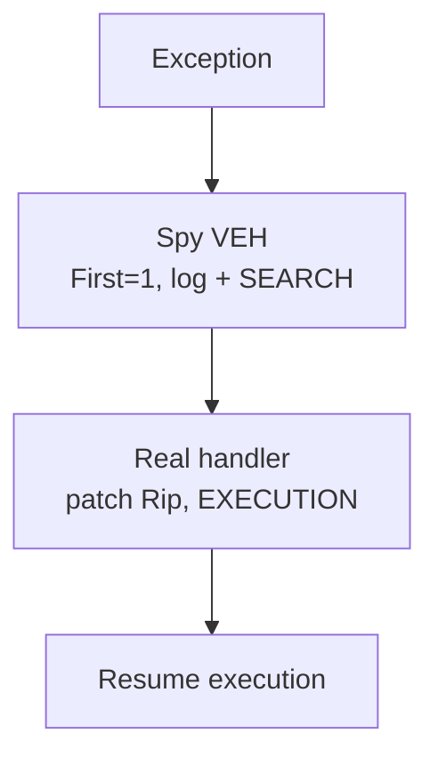

# EDR monitoring problem

Security products register `AddVectoredExceptionHandler(1, …)` to observe **every** exception:

- Log exception code, faulting address, thread context
- Return `EXCEPTION_CONTINUE_SEARCH` — transparent to the app
- Cheap, in-process telemetry without kernel callbacks or hooks on `RtlDispatchException`

---
layout: default
---

# Spy handler pattern



Spy never handles — it observes and defers. Real handler fixes the fault.

---
layout: default
---

# Live demo — `03-veh-spy`

```powershell
cd snippets/03-veh-spy
zig build run
```

Spy logs dispatch; real handler applies `Rip += 2`.

<!-- capture output before talk -->
