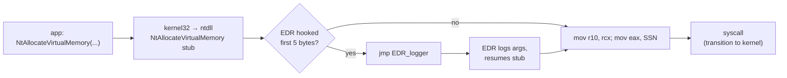
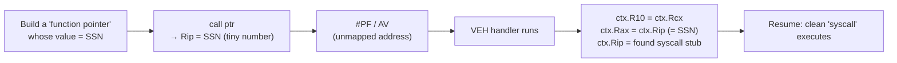
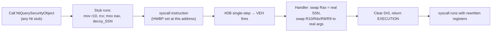

# Flipping sides: VEH for offense

We've seen VEH as **defense** (EDR spy). Now: VEH as **offense**.

Two ideas, same primitive:

1. **Vectored syscalls** — make an exception *do the syscall for you*. No `Nt*` stub in `ntdll` ever runs.
2. **HWBP tampering** — let the real `syscall` stub run, but use a hardware breakpoint + VEH to *rewrite the syscall number and arguments* at the last possible moment.

Both leave EDR inline hooks on `Nt*` exports completely unfired.

<!--
Section pivot. Stop and recap if students look lost — everything from here on uses the same handler + CONTEXT mutation we've already seen.

Why these two examples and not others?

- Vectored syscalls (VEH-PoC, ~2018) is the cleanest demonstration of "the handler IS the program logic." There's no normal control flow at the call site; the entire syscall happens during exception dispatch.

- HWBP tampering (TamperedSyscalls / Hells Gate variants) is the more practical of the two — looks much more like a normal call until the very last instruction. State-of-the-art tradecraft is in this family.

Both share the same trick: control the CONTEXT, let the kernel resume execution from a register state of your choosing.
-->

---
layout: default
---

# Normal syscall path (with EDR hook)



EDRs put a `jmp` at the start of `NtAllocateVirtualMemory`. **Every** call goes through them.

> Offensive goal: reach `syscall` **without** running the hooked prologue.

<!--
This is the threat model slide. Without it, the next two demos have no motivation.

Most commercial EDRs do exactly this: write a 5-byte jmp (or 12-byte abs jmp on x64) at the start of every interesting Nt* stub. When your code calls NtAllocateVirtualMemory, you jump straight into their telemetry function first. They log args, then resume the original stub.

This is "userland hooking" and it's been the bread-and-butter of EDR telemetry for a decade.

The bypass goal is simple to state: get from "I want to make this syscall" to "the syscall instruction executes with the right SSN in Rax and the right args in R10/Rdx/R8/R9" — WITHOUT touching the EDR-instrumented prologue.

There are many ways. We'll see two that lean on VEH.
-->

---
layout: default
---

# Idea 1: vectored syscalls

What if the **fault itself** IS the syscall trigger?



Hook on `NtAllocateVirtualMemory` stub? **Never executed.** We jump to a *different* `syscall` instruction in ntdll.

<!--
Walk the diagram carefully. The clever bit is using the SSN itself as the function pointer.

Step-by-step:
1. Find SSN of NtAllocateVirtualMemory (e.g. 0x18). That's a tiny integer.
2. Cast 0x18 to a function pointer with the right signature.
3. Call it. Rip becomes 0x18. The CPU tries to fetch instructions from address 0x18 → access violation.
4. Our VEH catches the AV. We inspect ctx.Rip and recognize it's the SSN we picked.
5. We set up registers as the kernel ABI expects: R10 ← Rcx (arg 0), Rax ← Rip (SSN), then point Rip to a SYSCALL; RET sequence we found earlier in ntdll.
6. Return CONTINUE_EXECUTION. The thread resumes, executes the SYSCALL, and we get the right kernel behaviour.

What the EDR sees: an access violation in our process, then... nothing. The hooked Nt stub was never called. The syscall happens from an arbitrary `syscall` instruction inside ntdll.

Trade-off: AVs are LOUD. EDRs that watch VEH will see an AV with Rip = 0x18, which is bizarre and easy to flag. So this technique works against unhooked-only EDRs but is detectable by sophisticated ones. Hence the next idea.
-->

---
layout: default
zoom: 0.85
---

# Vectored syscall handler — `04-vectored-syscall`

<<< @/../snippets/04-vectored-syscall/src/main.zig {31-43}

`g_syscall_addr` is a `syscall; ret` gadget located earlier by scanning ntdll. The handler is **6 lines**.

<!--
The handler is the entire bypass. Six effective lines.

- ExceptionCode == AV? if not, defer to next handler. Filter aggressively — we don't want to break the program's own AV recovery if any.
- ctx.R10 = ctx.Rcx → kernel ABI shuffle.
- ctx.Rax = ctx.Rip → at AV time, Rip is whatever weird value we 'called'. That value IS the SSN.
- ctx.Rip = g_syscall_addr → redirect resume to a real `syscall` instruction.
- Return CONTINUE_EXECUTION.

That's it. The rest of the file is plumbing: find a syscall gadget, find an SSN, register the handler, make the bogus call.

If someone asks "where do you get the SSN?" — Hell's Gate style: sort ntdll's Zw* exports by address, the index is the SSN. We do this in syscall_resolve.zig (in _shared module).
-->

---
layout: default
---

# Live demo — `04-vectored-syscall`

```powershell
cd snippets/04-vectored-syscall
zig build run
```

What you'll see:
- A real `NtAllocateVirtualMemory` allocation succeeds (0x100 bytes RW)
- No call to the actual `NtAllocateVirtualMemory` export was ever made
- An EDR watching only **hooks on Nt\* prologues** sees nothing

Benign payload: small RW allocation, no shellcode.

<!--
Run live. Output will show the SSN, the syscall stub address, and a successful status 0.

Two follow-up points to surface during the demo:

1. The trampoline approach. Notice we didn't have to use `syscall; ret` from inside any particular Nt* stub. ANY syscall instruction in ntdll works as a jumping-off point. The CPU doesn't care which export's body it's in.

2. Detection angle. A vigilant EDR sees an AV at Rip=0x18 (or whatever SSN). That's anomalous on its own. The honest assessment is: this technique evades naive userland hooking but trips proper VEH telemetry. It's a teaching example as much as a real-world bypass.
-->

---
layout: default
---

# Idea 2: hardware-breakpoint tampering

Look more legitimate: **let the real Nt stub run** — but swap registers at the last possible moment.



EDR sees a normal call to a normal stub. Kernel sees a different syscall happen.

<!--
This is the more interesting of the two from an offensive standpoint.

The decoy: we pick any Nt* export — here NtQuerySecurityObject. We don't care what it actually does. We just want its `syscall` instruction's address.

The trick: set a hardware breakpoint (Dr0) on that exact `syscall` byte. When execution reaches it — having faithfully gone through whatever prologue the EDR may have hooked — the CPU raises #DB before executing the syscall.

Our VEH catches the #DB. At this point Rax holds the DECOY's SSN. We swap it for the SSN we actually want, swap the args (which we passed via a side channel because the decoy's signature doesn't match ours), clear Dr0 so we don't re-trigger, return CONTINUE_EXECUTION.

Thread resumes one instruction earlier than expected? No — Rip is unchanged because #DB is a fault-class trap that re-executes the instruction. The syscall fires with our values in registers.

What the EDR sees: a perfectly normal call into NtQuerySecurityObject. The hooked prologue ran. The arguments at the entrypoint look like what NtQuerySecurityObject expects (or garbage — depends on the call setup). Then... a syscall happens that allocates memory. The cognitive dissonance for the telemetry pipeline is the point.
-->

---
layout: default
zoom: 0.85
---

# HWBP handler — `05-hwbp-syscall`

<<< @/../snippets/05-hwbp-syscall/src/main.zig {109-139}

- `ExceptionAddress == Dr0` → "this is the breakpoint we armed"
- Swap `Rax` (SSN) and `R10/Rdx/R8/R9` (args)
- **Clear Dr0** so we don't fault again at the same instruction

<!--
Walk the code top to bottom.

Lines 110-112: filter to STATUS_SINGLE_STEP only. Other handlers handle other exceptions; we only care about #DB.

Lines 114-124: validate the breakpoint is ours. The address has to match Dr0. Without this check, ANY single-step in the process would be hijacked — which is wrong for legitimate debuggers and might break things.

Lines 126-128: read the decoy SSN (just for the demo print).

Lines 130-134: the actual swap. Real SSN into Rax, real args (passed via the g_params global) into R10/Rdx/R8/R9. The kernel ABI: R10/Rdx/R8/R9 for first four args, stack for more.

Line 135: clear Dr0 to disarm. Without this, the syscall instruction would re-fault forever.

Line 136: also clear the armed flag so subsequent legitimate single-steps (debugger) aren't hijacked.

Return CONTINUE_EXECUTION. The thread resumes with rewritten state.
-->

---
layout: default
zoom: 0.8
---

# HWBP setup + call — `05-hwbp-syscall`

<<< @/../snippets/05-hwbp-syscall/src/main.zig {141-175}

Three steps: find the decoy's `syscall` byte, arm `Dr0`, smuggle args into a global, call the decoy.

<!--
Walk the setup.

Lines 145-150: resolution. Get the real SSN (NtAllocateVirtualMemory). Get any decoy stub (NtQuerySecurityObject). Scan forward 0x40 bytes for `0F 05` to find the exact `syscall` opcode — that's where we'll set the HWBP.

Lines 155-158: register the VEH handler. Standard pattern.

Lines 160-162: install the hardware breakpoint. This sets Dr0 to the address and configures Dr7 (the control register) for: execute-type breakpoint, length 1 byte, locally enabled. The asm of installHardwareBreakpoint uses GetThreadContext / SetThreadContext under the hood — that's because debug registers can't be written from user mode directly.

Lines 164-174: arrange the call. Pass the real args into the g_params global; the handler will read them when #DB fires.

Then (continued past slide): call the decoy. The decoy executes its prologue (mov r10, rcx; mov eax, decoy_SSN), hits the syscall byte, #DB fires, handler swaps the state, syscall executes with our values.
-->

---
layout: default
---

# Live demo — `05-hwbp-syscall`

```powershell
cd snippets/05-hwbp-syscall
zig build run
```

Expected output highlights:

```
[VEH] Decoy SSN: <NtQuerySecurityObject's number>
[VEH] Real  SSN: <NtAllocateVirtualMemory's number>
[ok] decoy SSN replaced with resolved SSN
```

The kernel ran `NtAllocateVirtualMemory`. The call site looks like `NtQuerySecurityObject`.

<!--
Run live. The two SSNs printed back-to-back are the proof: the call entered through the decoy, the kernel exited through a different syscall number.

Discussion prompts if time allows:
- Why HWBPs and not software int3? Software breakpoints would modify the syscall byte, which a memory integrity check would detect.
- Why not just inline assembly that does mov eax, ssn; syscall? You can — that's the "direct syscall" technique. Detection: stack walk from kernel shows the syscall came from your module, not ntdll. The HWBP version makes the syscall appear to come from ntdll, defeating that detection.
- Why Dr0 and not Dr3? Pure convention; Dr0-Dr3 are all general-purpose data BPs. Dr0 is just first.
-->

---
layout: default
---

# Side by side

|                                  | Vectored syscall                           | HWBP tamper (single-step)              |
| -------------------------------- | ------------------------------------------ | -------------------------------------- |
| Trigger                          | `EXCEPTION_ACCESS_VIOLATION`               | `STATUS_SINGLE_STEP` at `Dr0`          |
| Setup                            | VEH only                                   | VEH + registers (`Dr0`/`Dr7`)          |
| Faulting Rip                     | A tiny integer (the SSN)                   | A valid `syscall` instruction in ntdll |
| Stealth vs. hook detection       | Defeats inline hooks                       | Defeats inline hooks                   |
| Stealth vs. VEH telemetry        | **Access Violations are easy to flag**     | **Looks like a normal stub call**      |
| Stealth vs. stack-walk telemetry | Stack shows Access Violation in our module | Kernel-side stack shows ntdll          |

> Both tamper `CONTEXT` inside a VEH. Different trigger, **same resume primitive**.

<!--
The comparison drives home that there's a tradecraft progression here:

1. Direct syscall (no VEH, no decoy) — defeats hooks, fails stack-walks.
2. Vectored syscall (AV trigger) — defeats hooks, fails VEH telemetry.
3. HWBP tamper — defeats hooks AND VEH telemetry AND stack-walks, but adds Dr0/Dr7 manipulation which itself is monitored by some EDRs.

There's no free lunch. Each technique trades one signal for another. Modern offensive tooling chains multiple primitives and varies them per call to muddy the picture.

The unifying takeaway: VEH is the foundation. Every technique here is "register a handler, fault on purpose, rewrite CONTEXT, return CONTINUE_EXECUTION." Master that loop and you understand the whole family.
-->

